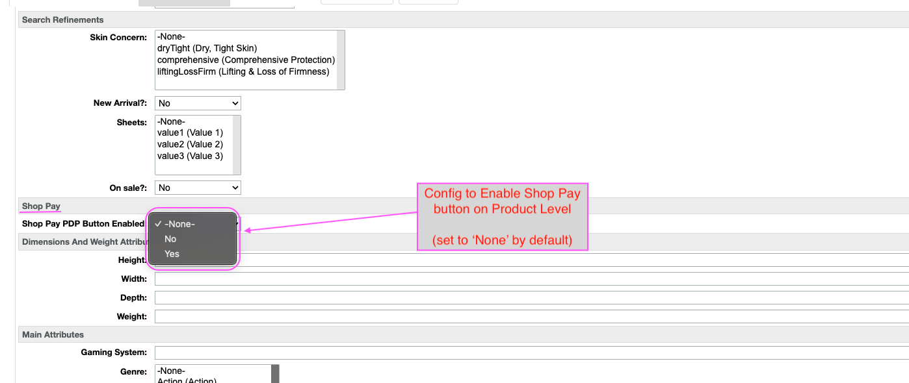

# SFCC Shop Pay Connector Reference Code Integration Guide

Version 1.0.0

March 2024

## Table of Contents

[1. Connector reference code Version and Compatibility](#1-connector-reference-code-version-and-compatibility)

[2. Supported Features](#2-supported-features)

   * [2.1. General Applicability](#21-general-applicability)

      * [2.1.1. Supported Currencies and Transaction Minimums](#211-supported-currencies-and-transaction-minimums)

   * [2.2. Shipping Scenarios](#22-shipping-scenarios)

      * [2.2.1. Supported Shipping Scenarios](#221-supported-shipping-scenarios)

   * [2.3. PDP: "Buy With" (aka "Buy Now")](#23-pdp-buy-with-aka-buy-now))

   * [2.4. Cart: Express Checkout](#24-cart-express-checkout)

      * [2.4.1. `initShopPayCart.js` within the `int_shoppay_sfra` connector reference code](#241-initshoppaycartjs-within-the-int_shoppay_sfra-connector-reference-code)

      * [2.4.2. `shoppayHelper.js` within the `int_shoppay_sfra` connector reference code](#242-shoppayhelperjs-within-the-int_shoppay_sfra-connector-reference-code)

      * [2.4.3. `ShopPay.js` within the `int_shoppay_sfra` connector reference code](#243-shoppayjs-within-the-int_shoppay_sfra-connector-reference-code)

   * [2.5. Checkout: Express Checkout](#25-checkout-express-checkout)

      * [2.5.1. `initShopPayCart.js` within the `int_shoppay_sfra` connector reference code](#251-initshoppaycartjs-within-the-int_shoppay_sfra-connector-reference-code)

      * [2.5.2 `shoppayHelper.js` within the `int_shoppay_sfra` connector reference code](#252-shoppayhelperjs-within-the-int_shoppay_sfra-connector-reference-code)

      * [2.5.3. `ShopPay.js` within the `int_shoppay_sfra` connector reference code](#253-shoppayjs-within-the-int_shoppay_sfra-connector-reference-code)

[3. Installation](#3-installation)

   * [3.1. Shopify Store Setup](#31-shopify-store-setup)

   * [3.2. SFCC Connector reference code Installation](#32-sfcc-connector-reference-code-installation)

      * [3.2.1. Metadata Import](#321-metadata-import)

      * [3.2.2. Site Preferences](#322-site-preferences)

         * [Summary of SFCC Site Preferences for Shop Pay](#summary-of-sfcc-site-preferences-for-shop-pay)

      * [3.2.3. Other Configurations](#323-other-configurations)

         * [Build and Upload Code](#build-and-upload-code)

         * [Configure the Custom Payment Method](#configure-the-custom-payment-method)

         * [Configure the Web Service Profiles](#configure-the-web-service-profiles)

         * [Configure the `Cartridges` Paths](#configure-the-cartridges-paths)

         * [Optional: Configure the Product Data](#optional-configure-the-product-data)

         * [Configure Required Jobs](#configure-required-jobs)

[4. The Shopify Commerce Component](#4-the-shopify-commerce-component)

   * [4.1. GraphQL](#41-graphql)

[5. SFCC Post-Checkout Processing](#5-sfcc-post-checkout-processing)

   * [5.1. Webhooks](#51-webhooks)

      * [5.1.1 Mandatory Webhook Subscriptions](#511-mandatory-webhook-subscriptions)

      * [5.1.2. `ORDERS_CREATE` Webhook](#512-orders_create-webhook)

         * [Sample `ORDERS_CREATE` Webhook Payload](#sample-orders_create-webhook-payload)

   * [5.2. Jobs](#52-jobs)

      * [5.2.1. Shop Pay Order Reconciliation](#521-shop-pay-order-reconciliation-job)

      * [5.2.2. Shopify Webhook Subscribe](#522-shopify-webhook-subscribe-job)

         * [Special Consideration for On Demand Sandboxes](#special-consideration-for-on-demand-sandboxes)

      * [5.2.3. Shopify Webhook Unsubscribe](#523-shopify-webhook-unsubscribe-job)

      * [5.2.4. Maintain Shopify Webhook Subscriptions](#524-maintain-shopify-webhook-subscriptions-job)

[6. Post-Payment Guidance for OMS](#6-post-payment-guidance-for-oms)

   * [6.1. Order Transactions](#61-order-transactions)

      * [6.1.1. Payment Capture](#611-payment-capture)

         * [Sample `orderCapture` Mutation Request](#sample-ordercapture-mutation-request)

         * [Sample `orderCapture` Mutation Response](#sample-ordercapture-mutation-response)

      * [6.1.2. `ORDER_TRANSACTIONS_CREATE` Webhook](#612-order_transactions_create-webhook)

         * [Sample `ORDER_TRANSACTIONS_CREATE` Webhook Payload](#sample-order_transactions_create-webhook-payload)

   * [6.2. Fulfillment Tracking](#62-fulfillment-tracking)

   * [6.3. Refund Creation](#63-refund-creation)

   * [6.4. Handling Disputes](#64-handling-disputes)

      * [6.4.1. `DISPUTES_CREATE` Webhook](#641-disputes_create-webhook)

         * [Sample `DISPUTES_CREATE` Webhook Payload](#sample-disputes_create-webhook-payload)

      * [6.4.2. `DISPUTES_UPDATE` Webhook](#642-disputes_update-webhook)

         * [Sample `DISPUTES_UPDATE` Webhook Payload](#sample-disputes_update-webhook-payload)

      * [6.5. Subscribing to Webhooks](#65-subscribing-to-webhooks)

[7. A/A and A/B Testing](#7-aa-and-ab-testing)

   * [7.1. A/A and A/B Testing Connector reference code](#71-aa-and-ab-testing-connector-reference-code)

      * [7.1.1. Disable the Shop Pay Button on PDP and Cart](#711-disable-the-shop-pay-button-on-pdp-and-cart)

         * [Disable the Shop Pay button in the Cart](#disable-the-shop-pay-button-in-the-cart)

         * [Disable the Shop Pay button in the PDP](#disable-the-shop-pay-button-in-the-pdp)

      * [7.1.2. Shop Pay A/B Testing Cookie](#712-shop-pay-ab-testing-cookie)

      * [7.1.3. Notes About Base64 Cookie String](#713-notes-about-base64-cookie-string)

      * [7.1.4. Notes About Cookie Partitioning](#714-notes-about-cookie-partitioning)

   * [7.2. Configuring and Running the A/A and A/B Tests](#72-configuring-and-running-the-aa-and-ab-tests)

[8. Connector reference code Extensibility and Customizability](#8-connector-reference-code-extensibility-and-customizability)

   * [8.1. Overrides](#81-overrides)

   * [8.2. Extension Hooks](#82-extension-hooks)

[9. Known Limitations](#9-known-limitations)

   * [9.1. Shipping Surcharges](#91-shipping-surcharges)

   * [9.2. Disabled Button State](#92-disabled-button-state)

   * [9.3. Shop Pay Button in Mini-Cart Flyout](#93-shop-pay-button-in-mini-cart-flyout)

   * [9.4. Product Options](#94-product-options)

## 1. Connector reference code Version and Compatibility

This integration guide provides details on how to integrate Version **1.0** of the Shop Pay Connector reference code into a standard SFRA storefront. The connector reference code bundle includes the following individual connector reference codes:

* `int_shoppay`
* `int_shoppay_sfra`
* `int_shoppay_ab`

The `int_shoppay` connector reference code contains core functionality such as client-side javascript, helper scripts, and header script includes. The `int_shoppay_sfra` connector reference code contains code that is specific to the SFRA framework, such as controllers and models. The `int_shoppay_ab` connector reference code is a starter/sample connector reference code for implementing mandatory A/A and A/B testing of the Shop Pay payment option on the SFCC storefront. More details on A/A and A/B testing can be found in [A/A and A/B Testing](#a/a-and-a/b-testing).

This connector reference code bundle has been tested with SFCC compatibility modes **21.7** and **22.7**. This connector reference code is also compatible with SFRA versions **6.0.0** through **6.3.0**. SFRA version **6.0.0** introduced breaking changes, including relocating checkout login from a standalone controller to directly within the single page checkout. Therefore, modifications are required to use this connector reference code with SFRA versions older than **6.0.0**. It is also expected that some retooling might be required to use this connector reference code with recently released SFRA version **7.0.0**, which upgrades node support to version **18.19** from version **12.21**.

## 2. Supported Features

The features supported by this connector reference code bundle for SFCC include a now" button for PDP, express checkouts using the Shop Pay modal, and order creation in both SFCC and Shopify for compatibility with Shopify’s Shop app. This connector reference code bundle was designed with extensibility and customizability in mind with modular code that lends itself to overrides, SFRA extension hooks included in custom controllers, and a sample connector reference code to support mandatory A/B testing.

The Shop Pay modal provides customers with a quick and easy checkout experience to complete their transaction with Shop Pay in just a few clicks. The "Buy now" feature allows customers to add an individual product to the cart and begin checkout for that selection with a single click on the Product Details Page (PDP).

This integration includes webhooks and jobs for post-payment processing, including order reconciliation, webhook subscription / unsubscription, and webhook subscription monitoring. Guidance for OMS systems to implement post-payment processes such as payment capture, fulfillment tracking, and refund creation is also included in this integration guide.

### 2.1. General Applicability

To use the Shop Pay Commerce Component in SFCC, merchants must have a Shopify store that's been configured by Shopify for use of Shop Pay Commerce Component.

The Shop Pay Commerce Component implementation does not include other Shopify Payments features such as:

* Installments (pay over time)
* Subscriptions

The Shop Pay Commerce Component is not eligible for use in the following storefront scenarios:

* Multi-shipping
* "Buy with" (aka "Buy now") for Product Sets

#### 2.1.1. Supported Currencies and Transaction Minimums

| Currency Code | Minimum Transaction Amount* |
| :---- | :---- |
| USD, ADU, CAD, NZD, SGD | $.50 |
| DKK | 2.50-kr |
| EUR | €.50 |
| GBP | £.30 |
| HKD | $4.00 |
| JPY | 50¥ |
| RON | lei2.00 |
| CZE | Kč 15.00 |

> *The maximum transaction amount for all currencies is 999,999.99 (8 digits).

For a complete list of supported currencies, see [https://help.shopify.com/en/manual/markets/pricing/supported-currencies](https://help.shopify.com/en/manual/markets/pricing/supported-currencies).

### 2.2. Shipping Scenarios

The Shop Pay modal currently does not support multiple shipping addresses. Digital products that are not physically shipped are supported, but all cart products must be combined into a single shipment in the Shop Pay modal. The table below summarizes the shipping scenarios that are supported by this connector reference code bundle and highlights scenarios that may require some customization.

#### 2.2.1. Supported Shipping Scenarios

| Shipping Scenario | Supported? | Notes |
| :---- | :---- | :---- |
| 1 Home Delivery | Yes |  |
| 1+ BOPIS | Yes |  |
| 1 Digital | Yes | May require customization* |
| 2+ Home Delivery | No |  |
| 1 Home Delivery + 1 Digital | Yes | May require customization* |

> *Refer to [Connector reference code Extensibility and Customizability](#connector-reference-code-extensibility-and-customizability) for more details

### 2.3. PDP: "Buy With" (aka "Buy Now")

The connector reference code’s "Buy now" feature allows users to purchase a product directly from the Product Details Page (PDP) without having to enter into the standard checkout flow. Users who click the "Buy now" button will initiate the Shop Pay modal with the selected item directly from the PDP.

Below is an example of the Out-of-the-Box (OOTB) "Buy now" button users will see on the PDP when the necessary connector reference code metadata and button configurations have been entered into **SFCC Business Manager** (BM):


The "Buy now" button cannot be clicked until all required product attributes have been selected (ex: color, size, etc.). Pointer events are restored on the button after required attributes are selected so the user can launch the Shop Pay modal and initiate/complete a transaction.

The button is rendered on page load when logic is triggered to initialize the Shop Pay config and create the button using methods from the Shop Pay SDK. This can be seen in the `initShopPayButton` function in `initShopPayCart.js` within the `int_shoppay_sfra` connector reference code. The snippet below illustrates how the button is rendered in by passing a flag to the `createButton()` SDK method and a selector to `render()`.

```javascript
let paymentSelector = '#shop-pay-button-container';
window.ShopPay.paymentRequest.createButton({buyWith: isBuyNow}).render(paymentSelector);
```

When a customer clicks the "Buy now" button, the Shop Pay modal is opened and displays the quantity of the item selected from the PDP. The modal will be pre-populated with account information for users who have a shop pay account (ex: address, saved credit cards, etc.). If the user does not have a Shop Pay account or is not logged into their Shop Pay account, then the modal will display the "Buy now" product and prompt the user to log in or create a new account.

The below screenshot illustrates the differences in what is displayed in the Shop Pay modal for logged in vs. logged out users who click the "Buy now" button:


Items existing in the user’s cart are excluded from the Modal if the customer clicks the "Buy now" button. This is handled by leveraging a temporary basket that operates independently from the basket a user may already have while shopping on the site. The user’s basket is waiting for them after they complete the "Buy now" transaction. This allows a seamless shopping experience after "Buy now" transactions by maintaining their session. Items in the cart can be purchased from the Cart page or during the checkout flow.

Product Sets are the only items not currently supported by the "Buy now" feature.

Information about configurations that control whether the "Buy now" feature is enabled on PDP is available in the [Other Configurations section](#other-configurations) within the Installation chapter below (see the *Optional: Configure the Product Data* subsection)

### 2.4. Cart: Express Checkout

When a user navigates to the cart page, they will encounter a Shop Pay express pay button that, when clicked, will initiate the Shop Pay modal with all items from their cart.

The button is rendered on page load when logic is triggered to initialize the Shop Pay config and create the button using methods from the Shop Pay SDK. The `initShopPayButton` function within `initShopPayCart.js` handles this logic from the `int_shoppay_sfra` connector reference code.

The same logical flow renders the button on the PDP, Cart and Checkout pages. A flag gets passed to the `window.ShopPay.PaymentRequest.createButton()` method to determine whether the rendered button is the standard Shop Pay button or the "Buy now" button. The standard Shop Pay will be rendered on the Cart & Checkout pages when the passed flag is false, whereas the "Buy now" button is rendered on the PDP when the passed flag is true.

Below is a screenshot of the Shop Pay button that gets rendered to the Cart page:


Any changes a user makes to the cart from the cart page will be reflected within the shop pay modal. For example, if a user enters a discount code - the session is updated with a new payment request so the Shop Pay modal will reflect the adjusted price and the promo code within the modal when opened. Additionally, if a user adjusts the quantity of an item from the cart page or if they remove an item from their cart - the session is updated with a new payment request so the latest changes are displayed when the user opens the modal.

The following screenshots provide a breakdown of user interaction on the cart page that are reflected within the Shop Pay modal once it is activated.


Similar to the PDP and the Checkout Page, three key files are essential to handle / update data to populate the Shop Pay modal with the right cart information (ex: list items, calculated taxes, applied promos, etc.):

#### 2.4.1. `initShopPayCart.js` within the `int_shoppay_sfra` connector reference code

* Houses logic that builds the Shop Pay button, initializes the shop pay session & calls necessary helpers (Note: review `initShopPaySession` , `initShopPayButton`, & `initShopPayConfig` functions).
* Contains watchers that detect cart & promotion updates within the cart (ex: `cart:update`, `promotion:success`, `product:afterAddToCart`). When these events are triggered, an ajax call is dispatched from the `buildPaymentRequest` helper function to the `ShopPay-GetCartSummary` controller.

#### 2.4.2. `shoppayHelper.js` within the `int_shoppay_sfra` connector reference code

* Houses Ajax handlers and logic to set up the Shop Pay listener events that are triggered when users interact within the Shop Pay modal (Note: Review the `setSessionListeners`, `buildPaymentRequest`, and `createResponse` functions).

#### 2.4.3. `ShopPay.js` within the `int_shoppay_sfra` connector reference code

* Contains backend logic, helper references & key controllers to get / update data based on every cart interaction (ex: `ShopPay-GetCartSummary`, etc.)

A configuration can be adjusted in **SFCC Business Manager** to control whether the express checkout Shop Pay button appears in the cart. Review the [Site Preferences](#site-preferences) section below for more information about this configuration.

### 2.5. Checkout: Express Checkout

When a user enters the standard checkout flow, they will encounter the Shop Pay button as an express payment option. In this context, users will be purchasing all items from their cart.

The Shop Pay button was placed at the top of the Checkout page for Out-of-the-Box SFRA implementations, however it can be relocated to the desired location within Checkout to support customized integrations.


Clicking the button will initiate the Shop Pay modal with address and payment information pre-populated from Account information the user has saved in their Shop Pay Account.


Three key files are essential to create & handle data needed to populate the Shop Pay modal with cart information (ex: list items, calculated taxes, applied promos, etc.):

#### 2.5.1. `initShopPayCart.js` within the `int_shoppay_sfra` connector reference code

* Handles logic to build the Shop Pay button, initialize the shop pay session & call necessary helpers from build the session object, etc. (Note: Review the `initShopPaySession` , `initShopPayButton`, and `initShopPayConfig` functions).

#### 2.5.2. `shoppayHelper.js` within the `int_shoppay_sfra` connector reference code

* Houses logic to get CSRF tokens & URLs, Ajax handlers to build / update payment request & response objects, and logic to set up the Shop Pay listener events that are triggered when users interact within the Shop Pay modal (Note: Review the `setSessionListeners`, `buildPaymentRequest`, and `createResponse` functions).

#### 2.5.3. `ShopPay.js` within the `int_shoppay_sfra` connector reference code

* Contains backend logic, helper references & key controllers (ex: `ShopPay-BeginSession`, `ShopPay-GetCartSummary`, etc.)

The Shop Pay integration features a special email recognition feature for Shop Pay users who enter their email address into the email field within the first stage of checkout. This is handled through the Shop Pay SDK.

Once a user fills in the email field in the first stage of checkout, the SDK reviews the entered email address and evaluates whether or not the email is associated with a Shop Pay account. If it is, a pop-up modal will open up as soon as the user is finished entering in their email address (Note: The pop-up will initiate when users either manually typing into the field or if they use browser tools to auto fill the field).

The following screenshot illustrates how the modal will appear for users with recognized emails when they are not currently logged into their Shop Pay account. (Ex: users are prompted to enter an authentication code from an SMS message in the authentication modal, to open the Shop Pay checkout popup)


Alternatively, the modal will offer a "Continue as" button to open the pop-up without authentication for users with recognized emails that are already logged into their Shop Pay account.


The Express Checkout button and the email recognition in checkout are available as a part of the overall connector reference code and will be functional after following the [Installation setup section](#installation) steps outlined below.

## 3. Installation

### 3.1. Shopify Store Setup

1. Shopify Store Necessity
   * A Shopify store that's been configured by Shopify for Shop Pay Commerce Component is essential for seamless integration with the Shop.app and the Shop Pay SDK.
2. Configuration Steps
   * Configure billing and payments for the Shopify store.
   * Set payment to test mode for testing in the Shopify store.
   * Configure a custom app in the Shopify store to communicate with Shop.app.
   * Create test user accounts at [Shop.app](https://shop.app).
   * Enable the test flag in the Shop.app account to add a test credit card and billing info. (The Shopify team will assist with this step.)
3. Reference Materials
   * Refer to Shopify's [Shop Pay Commerce Component shop configuration guide](https://shopify.dev/docs/api/commerce-components/pay/shop-configuration) for detailed explanations and instructions.

### 3.2. SFCC Connector reference code Installation

#### 3.2.1. Metadata Import

The `metadata` folder in the connector reference code bundle contains all of the meta data necessary to support the Shop Pay Commerce Component integration. This directory does contain a site specific-subdirectory of metadata that can be used as a starting point for any/all sites, but does need to be renamed prior to zip and import. Below is a list of basic steps to follow to import the metadata into an SFCC environment.

1. In the connector reference code code base, find and expand the `metadata` folder.
2. Within the `metadata` folder, find the `RefArch` subfolder.
3. If Shop Pay will be enabled on more than one site within an SFCC instance, make additional copies of the `RefArch` folder at the same level.
4. In **SFCC Business Manager** , navigate to **Administration > Sites > Manage Sites** and note the ID of each site that will enable/use Shop Pay payments.
5. Rename the `RefArch` folder with the Site ID from one of the sites identified in Business Manager.
6. Rename the `RefArch` folder copies with the Site IDs from the other sites identified in Business Manager.
7. Experienced system integrators may wish to make site-specific changes to the currencies and ranges in the `payment-methods.xml` file in each site folder before import. This is not required. Any necessary changes can be made manually in **SFCC Business Manager** after import as described in the [Other Configurations](#other-configurations) section below.
8. Zip the entire `metadata` directory. Note that the zip file must be named `metadata.zip` (matching the name of the top level directory in the zip file) or the file will not import successfully into Business Manager.
9. In **SFCC Business Manager** , navigate to **Administration > Site Development > Site Import & Export**.
10. Upload the `metadata.zip` file.
11. After the file has uploaded and appears in the file list, click on the radio button next to the `instance/metadata.zip` file and click **Import** to begin the import.
12. After a short wait, click Refresh at the bottom of the page, then again after another short wait and check the **Status** section to ensure that the import completed successfully.

Additional information about configuring the imported metadata for specific functionality, such as the "Buy now" button, is outlined in the [Other Configurations section](#323-other-configurations-other-configurations) below.

#### 3.2.2. Site Preferences

After the metadata has been successfully imported, configure the site preferences for the Shop Pay connector reference code. These preferences are located in the Shop Pay group in **SFCC Business Manager** at **Merchant Tools > Site Preferences > Custom Preferences**. The table below provides details about how each site preference is used and where to obtain the necessary values.

##### Summary of SFCC Site Preferences for Shop Pay

| Preference | Type | Description |
| :---- | :---- | :---- |
| Shop Pay PDP Button Enabled | `boolean` *(default: `false`)* | Controls whether the "Buy now" button appears on the PDP. ​​If set to Yes, the PDP button is enabled for all PDPs (except product sets). If set to No, the PDP button is enabled based on a product-level attribute. |
| Shop Pay Cart Button Enabled | `boolean` *(default: `false`)* | Controls whether the Shop Pay button for express checkout appears in the cart. If set to Yes, the Shop Pay button will be shown on the cart when the cart contents are eligible for checkout using Shop Pay. |
| Shopify Store Name | `string` | This is the name associated with the Shopify store that the merchant has configured. This value can be obtained from the URL of the Shopify store’s admin:  `https://admin.shopify.com/store/[Shopify Store Name]` |
| Shopify Store ID | `string` | This value corresponds to the Shopify store that the merchant has configured and will be provided by Shopify. It can also be retrieved using the GraphQL Admin API. |
| Shop Pay Client ID | `string` | This value corresponds to the Shopify store that the merchant has configured and the custom app that has been configured therein. The value will be provided by Shopify. |
| Shopify Admin API Access Token | `password` | This credential is used to connect to Shopify’s GraphQL Admin API. The value is obtained when configuring the custom app on the merchant’s Shopify store for use with the GraphQL Admin API. |
| Shopify Storefront API Access Token | `password` | This credential is used to connect to Shopify’s GraphQL Storefront API. The value is obtained when configuring the custom app on the merchant’s Shopify store for use with the GraphQL Storefront API. |
| Shopify Admin API Version | `string` *(default: `2024-01`)* | The Admin API version is used in the path for Shopify’s GraphQL Admin API service. At the time that this connector reference code was developed, `2024-01` was the latest version of the API. |
| Shopify Storefront API Version | `string` *(default: `unstable`)* | The Storefront API version is used in the path for Shopify’s GraphQL Storefront API service. At the time that this connector reference code was developed, only the ‘unstable’ version of the API supported the Commerce Component, however you should use the latest stable release. |
| Shopify Modal Image View Type | `string` *(default: `small`)* | Used to generate the product image URL used in the Shop Pay modal. This value should correspond to one of the view types configured in the SFCC store’s catalog. See details below. |
| Shop Pay Modal Debug Enabled | `boolean` *(default: `false`)* | Controls whether the Shop Pay SDK’s debug mode, with browser console logging, is enabled. If set to Yes, interactions with the Shop Pay modal will result in console logs with details about the interactions that may be helpful for troubleshooting or development. |
| Shop Pay Experiment ID | `string` | This ID will be provided by Shopify and will be unique to each A/A and/or A/B test performed for the site. |

The image below shows the image configurations in the SFRA sample master catalog. This interface can be found in **SFCC Business Manager** by navigating to **Merchant Tools > Products and Catalogs > Catalogs** and clicking on **Edit** next to the catalog that owns the products for the site. Then click on the **Image Settings** tab to view the current settings for the catalog.


SFCC supports view types for both internal and external image locations. Consider setting the **Shopify Modal Image View Type** preference to a value that is consistent with what is used in the cart or mini-cart on the SFRA storefront.

#### 3.2.3. Other Configurations

##### Build and Upload Code

Before final configurations can be completed, the SFCC code must be built and uploaded to the SFCC environment. This code contains custom job steps that need to be uploaded to the SFCC environment before the associated jobs can be properly configured and scheduled (or manually triggered). Refer to the [README](README.md) file in the connector reference code bundle for more details on building the connector reference code code.

##### Configure the Custom Payment Method

After the metadata has been successfully imported, configure and enable the Shop Pay payment method. The payment method is found in **SFCC Business Manager** at **Merchant Tools > Ordering > Payment Methods**. Click on the Shop Pay payment method to view the configuration options for that payment method.

Configurations for countries, currencies, and payment ranges may vary by site and will depend on the locales and currencies that are supported for the site. The [Supported Currencies and Transaction Minimums](#211-supported-currencies-and-transaction-minimums) table lists the currencies and transaction amounts that are supported by Shop Pay. The country, currency, and payment ranges for the Shop Pay payment method must align with what is supported by Shop Pay in addition to any site-specific locale and currency restrictions.

A sample configuration for the Shop Pay payment method is shown below for a US site that supports only USD as currency.


##### Configure the Web Service Profiles

After the metadata has been successfully imported, configure and enable the `Shop Pay web services`, `shoppay.api.admin` and `shoppay.api.storefront`. These services can be found in **SFCC Business Manager** at **Adminstration > Operations > Services**.

Click on each service in the **Services** tab to configure and enable communication logging, if desired. Click on the `shoppay.api.admin.profile` and the `shoppay.api.storefront.profile` profiles in the Profiles tab to adjust the service timeout and to configure and enable the circuit breaker and rate limits as desired.

No changes are required to the credentials for these services. The configured web service paths contain dynamic placeholders that are replaced with values from site preferences. The web service uses an access token in the request header for authentication, rather than basic authentication so the password and user fields can remain blank.

##### Configure the `Cartridges` Paths

In **SFCC Business Manager** , navigate to **Administration > Sites > Manage Sites**. Click on each site in the **Storefront Sites** section that will use the Shop Pay Commerce Component. In the Settings tab for each applicable site, add both `int_shoppay_sfra` and `int_shoppay` to the `Cartridges` field. The `int_shoppay_sfra` entry should always precede (sit "above") the `int_shoppay` entry in the path, as shown below for core SFRA.


In the section below the **Storefront Sites**, click on the **Business Manager** site. In the **Settings** tab for the **Business Manager** site, add `int_shoppay` to the `Cartridges` section as shown below for core SFRA. This configuration is necessary in order to run the Shop Pay jobs.


##### Optional: Configure the Product Data

The "Buy with" (aka "Buy now") feature uses two configurations to control whether the Shop Pay button is displayed on the PDP. This allows merchants the flexibility to enable the button for specific products only or for all PDPs on the site. This flexibility is achieved through a combination of a Site Preference and a Product-level attribute, both named Shop Pay PDP Button Enabled.

When the Site Preference is set to `Yes`, the button is enabled on *all* PDPs (except for product sets). Setting this preference to `Yes` will also override any product-level configurations to enable the PDP button. If the preference is set to `No`, the button must be enabled on the product-level for it to appear.

By default, this configuration is set to "None", which should be changed according to your needs.

| Site Preference | Product-Level Preference | Button Appearance |
| :---- | :---- | :---- |
| Yes | Yes or No | Yes |
| No | Yes | Yes |
| No | No | No |

Refer to the screenshot below for the default product-level configuration for the "Buy now" button.



##### Configure Required Jobs

After the code has been built and uploaded, configure and run the Shopify Webhook Subscribe job once per site as described in [Shopify Webhook Subscribe](#shopify-webhook-subscribe). This job sets up the framework necessary to receive the ORDERS\_CREATE webhook in SFCC to finalize orders that are placed using Shop Pay. All Shop Pay jobs can be found in **SFCC Business Manager** at **Administration \> Operations \> Jobs**.

Note that it may be necessary to toggle code versions in order for **SFCC Business Manager** to acknowledge and display the custom job steps used by these jobs. To toggle code versions, navigate to **Administration \> Site Development \> Code Deployment**. Click on "Activate" next to an inactive code version to activate it, then reactivate the original code version after a short wait.

Configure the Shop Pay Order Reconciliation job as described in [Shop Pay Order Reconciliation](#shop-pay-order-reconciliation). On primary instance group (PIG) environments, schedule and enable both the `Shop Pay Order Reconciliation` job and the Maintain Shopify Webhook Subscriptions job. The Order Reconciliation job serves as a fallback to finalize Shop Pay orders in the event that the ORDERS\_CREATE webhook is not delivered to the SFCC environment. The Maintain Shopify Webhook Subscription job ensures that the ORDERS\_CREATE webhook delivery is re-subscribed after too many delivery failures due to network issues, SFCC maintenance down time, etc. More details on the Maintain Shopify Webhook Subscriptions job can be found in [Maintain Shopify Webhook Subscriptions](#maintain-shopify-webhook-subscriptions). The cadence for these jobs will vary from merchant to merchant depending on order volume, maintenance cycles, etc.

## 4. The Shopify Commerce Component

The API from Shop Pay’s Commerce Component JavaScript allows merchants to use Shop Pay for checkout on their existing ecommerce sites. The majority of interactions in the Shop Pay Commerce component happen within the context of a Shopify-hosted pop-up window.

The SDK provides the Shop Pay Button and the Login Web components. These are loaded by including the load script on the relevant pages. The `shoppayScriptsIncludes.isml` template in the `/int_shoppay` folder loads the script onto the pages that require Shop Pay (snippet below):

```javascript
// This template will be included on every page that requires Shop Pay
<script src="https://cdn.shopify.com/shopifycloud/shop-js/shop-pay-payment-request.js">
```

Customers who click a Shop Pay button are recognized by email and are shown all relevant cart information. Customers can then complete their transactions in a similar experience to other sites that leverage Shop Pay as a payment option.

A sequence flow chart outlining the checkout flow is [available here](https://shopify.dev/docs/api/commerce-components/pay\#sequence-diagram).

The Shop Pay SDK manages the communication between SFCC and the Shop Pay modal. SFCC client-side Javascript attaches listeners to specific events triggered by the SDK. When a listener is triggered, SFCC’s client-side scripts exchange information with custom controllers on the SFCC back end to synchronize the SFCC cart and return an updated cart summary and totals to the Shop Pay SDK. During two specific events, `sessionrequested` and `paymentconfirmationrequested`, the SFCC custom controllers use web services to transact with Shopify’s GraphQL Storefront API.

### 4.1 GraphQL

Shopify uses GraphQL for many of the web service interactions with its APIs. Although the SFCC service framework does not directly support a GraphQL-type service, these web service calls can be successfully implemented using the standard SFCC service framework with an HTTP-type service. To use a GraphQL request body with an SFCC HTTP service, the mutation or query must be stringified and passed as a `query` entry in the request body. Any variables should be passed as JSON in a `variables` entry in the request body. The GraphQL response is standard JSON and can be parsed and handled as with any other HTTP service. This integration guide includes several sample GraphQL requests that are presented in this format.

Access tokens for using the GraphQL Storefront and Admin APIs can be found in the API configurations of the custom app that is installed on the Shopify store. The access token for the Storefront API must be passed in an `X-Shopify-Storefront-Access-Token` header with all requests. Refer to Shopify's [Shop Pay Commerce Component shop configuration guide](https://shopify.dev/docs/api/commerce-components/pay/shop-configuration) for more details on configuring the custom app in the Shopify store.

## 5. SFCC Post-Checkout Processing

### 5.1. Webhooks

A payment request must first be validated in the merchant system including inventory reservation, discount and pricing validation before submitting the final Shop Pay payment request, which will then create the order in Shopify.

Although rare, there can be a delay before an order becomes available via the Shopify API. It’s important to ensure that synchronous order creation is not required for functionality of your checkout. Instead, webhooks should be used as the primary method for order creation confirmation, with a reconciliation job as a backup.

At a minimum, merchants need to set up the webhooks listed in the table below.

#### 5.1.1 Mandatory Webhook Subscriptions

| Webhook Topic | Description | Subscribing System |
| :---- | :---- | :---- |
| ORDERS_CREATE | A webhook is sent every time an order is created. | SFCC |
| ORDER_TRANSACTIONS_CREATE | A webhook is sent every time an order transaction is created. | Typically OMS* |
| DISPUTES_CREATE | A webhook is sent every time a dispute is created. This requires the `read_shopify_payments_disputes` scope on your custom app. | Typically OMS* |
| DISPUTES_UPDATE | A webhook is sent every time a dispute is updated. This requires the `read_shopify_payments_disputes` scope on your custom app. | Typically OMS* |

*Refer to [Post-Payment Guidance for OMS](#6-post-payment-guidance-for-oms) for more details.

#### 5.1.2. `ORDERS_CREATE` Webhook

The ORDERS_CREATE webhook payload is sent from Shopify every time an order is created in Shopify. The payload is usually delivered very shortly after the Shop Pay order has been created in SFCC and contains details about the Shopify order that are not available during checkout with the Shop Pay modal.

When the Shopify Webhook Subscribe job makes the request to Shopify to subscribe to the ORDERS_CREATE webhook, it requests only a subset of the order data to reduce the payload volume to only the elements required to complete the SFCC order. A sample payload for this webhook, with these filters applied, is shown below.

##### Sample `ORDERS_CREATE` Webhook Payload

```json
{
    "admin_graphql_api_id": "gid://shopify/Order/5799705182528",
    "billing_address": {
        "address1": "100 West Main Street",
        "address2": "",
        "city": "Chicago",
        "company": "",
        "country": "United States",
        "country_code": "US",
        "first_name": "Jane",
        "last_name": "Van Andel",
        "latitude": 41.8823361,
        "longitude": -87.6403662,
        "name": "Doe",
        "phone": null,
        "province": "Illinois",
        "province_code": "IL",
        "zip": "60661"
    },
    "confirmed": true,
    "customer": {
        "admin_graphql_api_id": "gid://shopify/Customer/8026366148928",
        "created_at": "2024-01-31T10:57:42-05:00",
        "currency": "USD",
        "default_address": {
            "address1": "100 West Main Street",
            "address2": "",
            "city": "Chicago",
            "company": "",
            "country": "United States",
            "country_code": "US",
            "country_name": "United States",
            "customer_id": 8026366148928,
            "default": true,
            "first_name": "Jane",
            "id": 10224345481536,
            "last_name": "Doe",
            "name": "Jane Doe",
            "phone": "+13125555555",
            "province": "Illinois",
            "province_code": "IL",
            "zip": "60661"
        },
        "email": "jane.doe1234@example.com",
        "email_marketing_consent": {
            "consent_updated_at": null,
            "opt_in_level": "single_opt_in",
            "state": "not_subscribed"
        },
        "first_name": "Jane",
        "id": 8026366148928,
        "last_name": "Doe",
        "multipass_identifier": null,
        "note": null,
        "phone": "+13125555555",
        "sms_marketing_consent": {
            "consent_collected_from": "SHOPIFY",
            "consent_updated_at": null,
            "opt_in_level": "single_opt_in",
            "state": "not_subscribed"
        },
        "state": "disabled",
        "tags": "",
        "tax_exempt": false,
        "tax_exemptions": [],
        "updated_at": "2024-03-01T10:13:35-05:00",
        "verified_email": true
    },
    "email": "jane.doe1234@example.com",
    "name": "#1180",
    "source_identifier": "26e738d3627c3298380d128f48",
    "total_price": "42.49",
    "updated_at": "2024-03-01T10:13:36-05:00"
}
```

When this webhook payload is received in SFCC, SFCC updates the billing address, customer data, and custom attributes on the SFCC order and places the order. Prior to receipt of the webhook payload, a successful Shop Pay order is in Created state. When the webhook payload has been successfully received, the order will be in New or Open status. The following custom attributes will also be populated on the order after the webhook payload has been processed:


If the webhook payload is not delivered, or if an error occurs in processing the webhook, the order will be picked up by the `Shop Pay Order Reconciliation` job to finalize the order.

More details on Shopify webhooks can be found at [Webhook best practices](https://shopify.dev/docs/apps/webhooks/best-practices).

### 5.2. Jobs

#### 5.2.1. `Shop Pay Order Reconciliation` Job

**Purpose**
The `Shop Pay Order Reconciliation` job finds and finalizes Shop Pay orders for which the ORDERS_CREATE webhook payload was not received after checkout.

If an order cannot be finalized and placed, the job logs the order number and moves on to the next order. Though unlikely, an order could get "stuck" in `Created` status for an extended period of time if it cannot be finalized and placed for some reason. It is recommended to include monitoring for orders "stuck" in `Created` status to existing order monitoring jobs, processes, or other tools. If no such tool or processes exists (or if they cannot be easily adapted to this scenario), consider creating a simple job to perform this monitoring on a schedule. The SFCC job components connector reference code includes job steps that could be used as a guide/model to create a simple order monitoring job.

Since the `ORDERS_CREATE` webhook has a very high delivery and success rate, there may be no (or very few) orders available to test the `Shop Pay Order Reconciliation` job on environments that are subscribed to this webhook. In this event, [consider unsubscribing](#53-shopify-webhook-unsubscribe) from the `ORDERS_CREATE` webhook on a short-term basis and placing some test orders on the storefront. Then manually trigger the `Shop Pay Order Reconciliation` job to process those orders. Be sure to run the Shopify Webhook Subscribe job afterward to resubscribe to the webhook.

**Scheduling**
This job should be scheduled to run regularly on SFCC environments in the primary instance group (PIG).

**Job Steps**
This job utilizes a single custom job step (`Custom.Shoppay.OrderReconciliation`), shown below.


**Job Scope**
Site

**Job Inputs**

`MaxOrderAgeHrs`

* Mandatory: `false`
* Type: `long`
* Usage: If this input is left blank, the job will search for and process all Shop Pay orders, regardless of age, that have not been finalized. If this input is populated, the job will search for and process only orders that were placed within the past number of hours specified by the input. Note that the standard Shopify orders access scope only provides access to Shopify orders placed within the past 30 days. There is a special app scope that must be set on the custom app installed in the Shopify store in order to access orders older than this through the API.

`MinOrderAgeSecs`

* Mandatory: `true`
* Type: `long`
* Usage: This input provides buffering to allow the `ORDERS_CREATE` webhook payload to be received and handled before being picked up and processed by this job. Typically the webhook payload is received for an order within a very short time (seconds) of checkout completion on the storefront. Orders that were placed fewer seconds ago than specified by the input will not be picked up by the job.

#### 5.2.2. `Shopify Webhook Subscribe` Job

##### Special Consideration for On Demand Sandboxes

On demand sandboxes are often shut down on a regular schedule for part of the day to reduce costs when they are not in use. If that sandbox is subscribed to a Shopify webhook, webhook delivery to that sandbox endpoint will fail while it is shut down and Shopify will automatically unsubscribe that endpoint from webhook delivery after 19 consecutive failures. Consider simply running the `Shop Pay Order Reconciliation` job on an as needed to finalize orders on sandboxes that routinely shut down and only subscribe (and unsubscribe) to webhooks from those sandboxes as needed for development work on related scripts and controllers.

**Purpose**
This job is used to subscribe to webhook topics that are necessary for post-payment processing of Shop Pay orders within SFCC.

**Scheduling**
This job should not be scheduled to run regularly on any SFCC environment. It should only be triggered manually on an as-needed basis.

**Job Steps**
This job utilizes a single custom job step (Custom.Shoppay.SubscribeWebhook), shown below.


**Job Scope**
Site

**Job Inputs**

`WebhookTopic`

* Mandatory: `false`. However, the job step will exit with an error if a value is not provided.
* Type: `enum` of `strings`
* Usage: `Webhook topic` is a mandatory field in the Shopify GraphQL call to subscribe to a webhook. Webhook payloads and usages differ per webhook topic.

`CallbackURL`

* Mandatory: `false`
* Type: `string`
* Usage: If the `CallbackURL` input field is left empty, the job will use mapped endpoints (by webhook topic) to subscribe the appropriate SFCC controller endpoint for webhook delivery. However, if complications occur due to aliasing configurations, or if middleware or other proxy is used instead, this input field can be used to subscribe an alternate endpoint for webhook delivery. The value must be an absolute URL (e.g., <https://my.example.com/webhooks/orderscreate>).

#### 5.2.3. `Shopify Webhook Unsubscribe` Job

**Purpose**
This job is used to unsubscribe from a webhook topic. Generally, it is not necessary to unsubscribe from webhook topics in SFCC. However, this job may be useful in testing the `Shop Pay Order Reconciliation` job during connector reference code integration as the `ORDERS_CREATE` payload will not be received if the webhook subscription has been deleted for the applicable callback endpoint.

**Scheduling**
This job should not be scheduled to run regularly on any SFCC environment. It should only be triggered manually on an as-needed basis.

**Job Steps**
This job utilizes a single custom job step (`Custom.Shoppay.UnsubscribeWebhook`), shown below.


**Job Scope**
Site

**Job Inputs**

`WebhookId`

* Mandatory: `false`. However, the job step will exit with an error if a value is not provided.
* Type: `string`
* Usage: This is the Shopify identifier used to unsubscribe from a webhook topic. The value should correspond to the Webhook Legacy Resource ID that was assigned by Shopify when the subscription to that webhook was created. This value can be found in the `ShopPayWebhookSubscriptions` custom object that was created in SFCC at the time of subscription creation.

#### 5.2.4. `Maintain Shopify Webhook Subscriptions` Job

**Purpose**
There are certain scenarios in which a webhook subscription can be removed outside of the SFCC Shopify Webhook Subscribe job. For example, if webhook delivery fails 19 times in a row, Shopify will automatically remove that webhook subscription. This job checks the webhook subscriptions that have been captured in the `ShopifyWebhookSubscriptions` custom objects and re-subscribes to any for which an active subscription no longer exists.

**Scheduling**
This job should be scheduled to run regularly on SFCC environments in the **Primary Instance Group** ("PIG").

**Job Steps**
This job utilizes a single custom job step (`Custom.Shoppay.UnsubscribeWebhook`), shown below.


**Job Scope**
Site

**Job Inputs**
This job has no input parameters.

## 6. Post-Payment Guidance for OMS

The post-payment process may involve capturing payments, adding tracking fulfillments, and issuing refunds. Typically, these processes are implemented by an external **Order Management System** ("OMS") and are therefore beyond the scope of this SFCC integration connector reference code. This section provides guidance on how to use the Shopify GraphQL Admin API for these tasks.

### 6.1. Order Transactions

Order transaction types:
* Authorization
  * An amount reserved against the cardholder's funding source. Money does not change hands until the authorization is captured.
* Capture
  * A transfer of the money that was reserved by an authorization.
* Change
  * The money returned to the customer when they've paid too much during a cash transaction.
* EMV Authorization
  * An authorization for a payment taken with an EMV credit card reader.
* Refund
  * A partial or full return of captured funds to the cardholder. A refund can happen only after a capture is processed.
* Sale
  * An authorization and capture performed together in a single step.
* Suggested Refund
  * A suggested refund transaction that can be used to create a refund.
* Void
  * A cancellation of an authorization transaction.

#### 6.1.1. Payment Capture

Based on payment capture configuration in Payments settings in the Shopify admin, the Shop Pay payment will be processed as an authorization or capture. If manual capture is configured, the GraphQL `orderCapture` mutation must be called to finalize the payment.

As payment capture is typically performed by the OMS after the order has been exported from SFCC, this connector reference code does not include an implementation for payment capture. If manual payment capture is required within SFCC, this process should be implemented after checkout is complete because the session submit/order creation process in Shopify is not entirely synchronous. The following changes may need to be made in an overlay connector reference code to implement payment capture in SFCC:

* Override the `placeOrder` function in `postProcessingHelpers.js` and customize order statuses, as needed, to prevent the order from exporting before payment capture is complete. This function is used by both the `Shop Pay Order Reconciliation` job and the `ShopPayWebhooks-OrderCreate` controller.
* Implement the GraphQL `orderCapture` mutation (see details below).
* Add a new custom job to implement payment capture. It may also be necessary to disable the `Shop Pay Order Reconciliation` job and/or incorporate some logic from it into the new payment capture job.
* If considerable modifications are required for `ORDERS_CREATE` webhook handling, consider creating a new controller to replace the `ShopPayWebhooks-OrdersCreate` controller rather than overriding or appending. Be sure to submit the alternate controller endpoint when subscribing to the `ORDERS_CREATE` webhook.
* Implement handling for and subscribe to the `ORDER_TRANSACTIONS_CREATE` webhook in SFCC (refer to [ORDER_TRANSACTIONS_CREATE Webhook](#order_transactions_create-webhook-order_transactions_create-webhook) below).

> Note: The X-Shopify-Access-Token header must be included in the GraphQL Admin API request for successful authentication with the API. The value for this token can be obtained in the Shopify Admin when the custom app is configured for use with the Admin API.

##### Sample `orderCapture` Mutation Request

```json
{
  "query":"mutation orderCapture($input: OrderCaptureInput!) {orderCapture(input: $input) {transaction {id amountSet {shopMoney {amount currencyCode} presentmentMoney {amount currencyCode}} kind status} userErrors {field message}}}",
  "variables": {
    "input": {
      "amount":"10.00",
      "currency":"USD",
      "id":"gid://shopify/Order/1",
      "parentTransactionId":"gid://shopify/OrderTransaction/1"
    }
  }
}
```

##### Sample `orderCapture` Mutation Response

```json
{
  "data": {
    "orderCapture": {
      "transaction": {
        "amountSet": {
          "presentmentMoney": {
            "amount": "10.00",
            "currencyCode": "USD"
          },
          "shopMoney": {
            "amount": "10.00",
            "currencyCode": "USD"
          }
        },
        "id": "gid://shopify/OrderTransaction/1",
        "kind": "CAPTURE",
        "status": "SUCCESS"
      },
      "userErrors": []
    }
  },
  "extensions": {
    ...
  }
}

```

#### 6.1.2. `ORDER_TRANSACTIONS_CREATE` Webhook

This webhook is triggered when an order transaction, such as payment capture, is created or when its status is updated. It is only triggered for transactions with a status of `success`, `failure` or `error`. If payment capture is implemented in SFCC, a handler for the `ORDER_TRANSACTIONS_CREATE` webhook should be implemented in SFCC to handle payloads where `kind` is `capture`.

OMS should also subscribe to the `ORDER_TRANSACTIONS_CREATE` webhook to be alerted to updates to the payment transaction in Shopify, but need only handle the transaction types that occur after the order has been exported from SFCC to OMS. Both OMS and SFCC can subscribe to the same webhook topic so long as the two subscriptions use different combinations of API keys, webhook subscription topics and/or `callbackURL`. More details on Shopify webhooks can be found at [Webhook best practices](https://shopify.dev/docs/apps/webhooks/best-practices).

##### Sample `ORDER_TRANSACTIONS_CREATE` Webhook Payload

```json
{
  "id": 120560818172775260,
  "order_id": 820982911946154500,
  "kind": "authorization",
  "gateway": "visa",
  "status": "success",
  "message": null,
  "created_at": "2021-12-31T19:00:00-05:00",
  "test": false,
  "authorization": "1001",
  "location_id": null,
  "user_id": null,
  "parent_id": null,
  "processed_at": null,
  "device_id": null,
  "error_code": null,
  "source_name": "web",
  "payment_details": {
    "credit_card_bin": null,
    "avs_result_code": null,
    "cvv_result_code": null,
    "credit_card_number": "•••• •••• •••• 1234",
    "credit_card_company": "Visa",
    "buyer_action_info": null,
    "credit_card_name": null,
    "credit_card_wallet": null,
    "credit_card_expiration_month": null,
    "credit_card_expiration_year": null,
    "payment_method_name": "visa"
  },
  "receipt": {},
  "amount": "403.00",
  "currency": "USD",
  "payment_id": "#9999.1",
  "total_unsettled_set": {
    "presentment_money": {
      "amount": "403.0",
      "currency": "USD"
    },
    "shop_money": {
      "amount": "403.0",
      "currency": "USD"
    }
  },
  "manual_payment_gateway": true,
  "admin_graphql_api_id": "gid://shopify/OrderTransaction/120560818172775265"
}
```

### 6.2. Fulfillment Tracking

In order for the customer to have access to order tracking information in the Shop app, OMS should use GraphQL to notify Shopify that the Shop Pay order has shipped and provide the shipment tracking for that order. This is a two step process. First, OMS needs to get the ID of the Shopify fulfillment order to modify. Next, OMS needs to update the fulfillment order with the shipment tracking information. Both tasks can be achieved using the GraphQL admin API. Sample requests for both tasks are shown below. More details on the GraphQL order query can be found at [order query](https://shopify.dev/docs/api/admin-graphql/2024-01/queries/order). More details on the GraphQL mutation can be found at [fulfillmentCreateV2](https://shopify.dev/docs/api/admin-graphql/2024-01/mutations/fulfillmentCreateV2).

> Note: The X-Shopify-Access-Token header must be included in the GraphQL Admin API request for successful authentication with the API. The value for this token can be obtained in the Shopify Admin when the custom app is configured for use with the Admin API.

#### 6.2.1 Sample `fulfillmentOrders` Query Request

```json
{
  "query":"{order(id:\"gid://shopify/Order/5484566184229\") {name sourceIdentifier displayFulfillmentStatus fulfillmentOrders(first:5) {edges {node {id deliveryMethod {serviceCode methodType} status}}}}}",
  "variables":{}
}

```

#### 6.2.2. Sample `fulfillmentOrders` Query Response

```json
{
    "data": {
        "order": {
            "name": "#1001",
            "sourceIdentifier": "45f200d85f54c1e09e185813714972a2",
            "displayFulfillmentStatus": "UNFULFILLED",
            "fulfillmentOrders": {
                "edges": [
                    {
                        "node": {
                            "id": "gid://shopify/FulfillmentOrder/6425322881317",
                            "deliveryMethod": {
                                "serviceCode": "custom",
                                "methodType": "SHIPPING"
                            },
                            "status": "OPEN"
                        }
                    }
                ]
            }
        }
    },
    "extensions": {
       ...
    }
}
```

#### 6.2.3. Sample `fulfillmentCreateV2` Mutation Request

```json
{
    "query": "mutation fulfillmentCreateV2($fulfillment: FulfillmentV2Input!) {fulfillmentCreateV2(fulfillment: $fulfillment) {fulfillment {id status trackingInfo(first: 10) {company number url}}userErrors {field message}}}",
    "variables": {
        "fulfillment": {
            "lineItemsByFulfillmentOrder": {
                "fulfillmentOrderId": "gid://shopify/FulfillmentOrder/1"
            },
            "trackingInfo": {
                "company": "UPS",
                "number": "1Z001985YW99744790"
            }
        }
    }
}
```

#### 6.2.4. Sample `fulfillmentCreateV2` Mutation Response

```json
{
  "data": {
    "fulfillmentCreateV2": {
      "fulfillment": {
        "id": "gid://shopify/Fulfillment/1",
        "status": "SUCCESS",
        "trackingInfo": [
          {
            "company": "UPS",
            "number": "1Z001985YW99744790",
            "url": "https://www.ups.com/WebTracking?loc=en_US&requester=ST&trackNums=1Z001985YW99744790"
          }
        ]
      },
      "userErrors": []
    }
  },
  "extensions": {
    ...
  }
}
```

### 6.3. Refund Creation

In the event of an order cancellation or return, it may be necessary for OMS to initiate a refund of the customer’s payment with Shop Pay. OMS should use the GraphQL Admin API to create a refund for the Shop Pay order. The order id used as input in the GraphQL request is captured on the SFCC order as the "Graph QL Order ID" (see below) during processing of the ORDERS\_CREATE webhook payload or GraphQL response in the `Shop Pay Order Reconciliation` job. A sample GraphQL request and response for creating a refund are shown below. More details on the GraphQL mutation can be found at [refundCreate](https://shopify.dev/docs/api/admin-graphql/2024-01/mutations/refundCreate).

> Note: The `X-Shopify-Access-Token` header must be included in the GraphQL Admin API request for successful authentication with the API. The value for this token can be obtained in the Shopify Admin when the custom app is configured for use with the Admin API.


#### 6.3.1. Sample `refundCreate` Mutation Request

```json
{
  "query":"mutation refundCreate($input: RefundInput!) {refundCreate(input: $input) {refund {id transactions(first: 10) {nodes {id kind status}}} userErrors {field message}}}",
  "variables": {
    "input": {
      "currency": "USD",
      "note": "Customer returned item",
      "orderId": "gid://shopify/Order/1",
      "transactions": [
        {
          "amount": "10.00",
          "gateway": "shopify_payments",
          "kind": "REFUND",
          "orderId": "gid://shopify/Order/1",
          "parentId": "gid://shopify/OrderTransaction/1"
        }
      ]
    }
  }
}
```

#### 6.3.2. Sample `refundCreate` Mutation Response

```json
{
  "data": {
    "refundCreate": {
      "refund": {
        "id": "gid://shopify/Refund/1",
        "transactions": {
          "nodes": [
            {
              "id": "gid://shopify/OrderTransaction/2",
              "kind": "REFUND",
              "status": "PENDING"
            }
          ]
        }
      },
      "userErrors": []
    }
  },
  "extensions": {
    ...
  }
}
```

### 6.4. Handling Disputes

A dispute, also known as a chargeback or inquiry, occurs when a buyer questions the legitimacy of a charge with their financial institution. To effectively manage disputes, merchants need to subscribe to specific webhooks and use the Shopify admin to view and address disputes. More details on handling chargebacks and disputes on Shopify can be found at [Shopify Help Center | Managing chargebacks](https://help.shopify.com/en/manual/payments/shopify-payments/managing-chargebacks).

#### 6.4.1. `DISPUTES_CREATE` Webhook

This webhook is triggered when a dispute is first created in the Shopify admin. The OMS will need to subscribe to this webhook topic in order to receive notification that a dispute has been created and to receive the details of that dispute. More details on Shopify webhooks can be found at [Webhook best practices](https://shopify.dev/docs/apps/webhooks/best-practices).

##### Sample `DISPUTES_CREATE` Webhook Payload

```json
{
  "id": 285332461850802050,
  "order_id": 820982911946154500,
  "type": "chargeback",
  "amount": "11.50",
  "currency": "CAD",
  "reason": "fraudulent",
  "network_reason_code": "4837",
  "status": "under_review",
  "evidence_due_by": "2021-12-30T19:00:00-05:00",
  "evidence_sent_on": null,
  "finalized_on": null,
  "initiated_at": "2021-12-31T19:00:00-05:00"
}
```

#### 6.4.2. `DISPUTES_UPDATE` Webhook

This webhook is triggered when a dispute is updated in the Shopify admin. The OMS will need to subscribe to this webhook topic in order to receive notification that a dispute has been updated and to receive the details of that updated dispute.

##### Sample `DISPUTES_UPDATE` Webhook Payload

```json
{
  "id": 285332461850802050,
  "order_id": 820982911946154500,
  "type": "chargeback",
  "amount": "11.50",
  "currency": "CAD",
  "reason": "fraudulent",
  "network_reason_code": "4837",
  "status": "under_review",
  "evidence_due_by": "2021-12-30T19:00:00-05:00",
  "evidence_sent_on": null,
  "finalized_on": null,
  "initiated_at": "2021-12-31T19:00:00-05:00"
}
```

### 6.5. Subscribing to Webhooks

Subscribing to webhooks is done using Shopify’s GraphQL Admin API. All GraphQL requests are POST requests to a single endpoint (`https://[Shopify Store Name].myshopify.com/admin/api/2024-01/graphql.json`) with query or mutation payloads that are specific to the desired action.

> Note: The `X-Shopify-Access-Token` header must be included in the GraphQL Admin API request for successful authentication with the API. The value for this token can be obtained in the Shopify Admin when the custom app is configured for use with the Admin API.

Below is an example of creating a new webhook subscription for the topic `ORDERS_CREATE` using the `webhookSubscriptionCreate` mutation. More details on the GraphQL mutation can be found at [webhookSubscriptionCreate](https://shopify.dev/docs/api/admin-graphql/2024-01/mutations/webhookSubscriptionCreate).

#### 6.5.1 Sample `webhookSubscriptionCreate` Mutation Request

```json
{
  "query": "mutation webhookSubscriptionCreate($topic: WebhookSubscriptionTopic!, $webhookSubscription: WebhookSubscriptionInput!) {webhookSubscriptionCreate(topic: $topic, webhookSubscription: $webhookSubscription) {userErrors {field message} webhookSubscription {id legacyResourceId format topic endpoint {__typename ... on WebhookHttpEndpoint {callbackUrl}}}}}",
  "variables": {
    "topic": ORDERS_CREATE,
    "webhookSubscription": {
      "format": "JSON",
      "callbackUrl": "https://mystore.com/webhooks/orders/create"
    }
  }
}
```

#### 6.5.2. Sample `webhookSubscriptionCreate` Mutation Response

```json
{
  "data": {
    "webhookSubscriptionCreate": {
      "userErrors": [],
      "webhookSubscription": {
        "id": "gid://shopify/WebhookSubscription/1448729248037",
        "legacyResourceId": "1448729248037",
        "format": "JSON",
        "topic": "ORDERS_CREATE",
        "endpoint": {
          "__typename": "WebhookHttpEndpoint",
          "callbackUrl": "https://example.org/endpoint"
        }
      }
    }
  },
  "extensions": {
    ...
  }
}
```

Note that a webhook subscription is automatically removed if 19 consecutive retried delivery attempts fail.

## 7. A/A and A/B Testing

The testing framework can measure the impact of the Shop Pay Commerce Component by validating whether the integration is improving the conversion lift. Evaluating success and key metrics is a two-part testing process composed of A/A and A/B testing.

A/A testing must be performed to validate that the testing framework randomly and evenly assigns storefront customers to groups. During this test, assignment and checkout tracking events will fire, but no group will see the Shop Pay payment option. After successful completion of A/A testing, the A/B test will begin.

A/B testing uses the same logic to assign storefront customers to groups and fire tracking events, however this time only the control group will not be presented with Shop Pay as a payment option. Refer to the Shop Pay Commerce Component Merchant-assigned A/B testing guide for more details on A/A and A/B testing.

### 7.1. A/A and A/B Testing Connector reference code

A sample connector reference code (`int_shoppay_ab`) has been included in this connector reference code bundle for A/A and A/B testing. Depending on the tools that a merchant’s site uses for standard A/B testing, it may be desirable to modify or extend this connector reference code. The key elements of this sample implementation are described below.

#### 7.1.1. Disable the Shop Pay Button on PDP and Cart

During A/B testing, the Shop Pay button must only be shown on the Checkout page. Rendering of this button on the Cart and PDP is controlled by Site Preferences and product-level attributes in **SFCC Business Manager** . The Shop Pay button on PDP and Cart must remain disabled until both A/A and A/B testing are complete.

##### Disable the Shop Pay button in the Cart

1. In SFCC Business manager, navigate to **Merchant Tools > Site Preferences > Custom Site Preferences > Shop Pay** and select `No` for the `Shop Pay Cart Button Enabled` preference.

##### Disable the Shop Pay button in the PDP

1. In SFCC Business manager, navigate to **Merchant Tools > Site Preferences > Custom Site Preferences > Shop Pay** and select `No` for the `Shop Pay PDP Button Enabled` preference.
2. Navigate to **Merchant Tools > Products and Catalogs > Products** and click on the **Advanced** tab.
3. In the **Extended Attributes** section, click on the first dropdown and select `Shop Pay PDP Button Enabled`.
4. In the same row, select `equals` in the middle dropdown.
5. In the same row, select `True` in the right-most dropdown.
6. Click `Find`.
7. If any matching products are found, click on each product to view the attributes and select `No` for the `Shop Pay PDP Button Enabled` attribute. Experienced **SFCC Business Manager** users may choose to use the Bulk Editing feature ("Edit All" button) instead to modify all of these products at once.

#### 7.1.2. Shop Pay A/B Testing Cookie

The sample A/B testing connector reference code uses a cookie named `shoppayAB` to store A/B testing attributes that are specific to an individual storefront customer for the length of the A/A and A/B testing periods. These attributes include the customer’s group assignment and a record of which checkout events have fired for that customer. This ensures that the customer’s group assignment remains consistent throughout the test period and that the checkout-complete tracking event is only fired once for after the checkout-begin tracking event is fired for that same customer.

For purposes of testing and customizing this connector reference code on lower SFCC environments, the cookie can be manually deleted using standard browser tools. This cookie will be regenerated upon entering checkout again.

Please be aware that customers not involved in the AA or AB test will be automatically excluded during the activation of such tests. Additionally, customers with invalid carts during Shop Pay checkout, specifically those containing BOPIS items, will also be excluded. `Excluded` is one of the three statuses that can be sent to Shopify for reporting, with the other two being `control` or `treatment`.

#### 7.1.3. Notes About Base64 Cookie String

Inspecting the value of the `shoppayAB` cookie using browser tools reveals that it is not plain-text or JSON – the cookie has been Base64 encoded. This is necessary to protect the integrity of the JSON object. Base64 encoding the stringified JSON object avoids issues with storing and parsing a JSON string with escaped characters and is also more secure as the data within cannot be immediately recognized. For testing purposes, the JavaScript `atob` function can be used in the browser console to decode the Base64 encoded cookie string (see syntax below). This will reveal the plain JSON string, facilitating verification of the object's properties and values. Other web-based tools are also available for decoding Base64 strings.

```javascript
atob('eyJzdWJqZWN0SWQiOiJhYnJvSTFFUGZJQ0hVNjJSa2Fhc2RETGw4SiIsImFiVGVzdCI6InNob3BwYXlBQSIsImFzc2lnbm1lbnRHcm91cCI6InRyZWF0bWVudCIsImlzQXNzaWduZWQiOnRydWUsImlzU3RhcnRlZCI6dHJ1ZX0=');
```

#### 7.1.4. Notes About Cookie Partitioning

To prepare for third-party cookie restrictions introduced by Google in 2024, SFCC added a new `Partitioned Cookies` feature switch to **SFCC Business Manager** with release `24.2`. More information on SFCC’s Cookie Partitioning Feature Switch can be found in the `24.2` B2C release notes at [Prepare for Third-Party Cookie Restrictions](https://help.salesforce.com/s/articleView?id=sf.b2c_rn_prepare_for_third_party_cookie_restrictions.htm). This feature switch can be found in **SFCC Business Manager** by navigating to **Administration > Global Preferences > Feature Switches**.

The sample A/B testing connector reference code **does not currently support partitioned cookies** because this is a fairly new SFCC feature switch that is disabled by default. Enabling this feature without first performing testing and/or code updates could cause some existing cookie integrations to break. As many merchants have likely not completed this process yet, the cookie implementation in this connector reference code was designed for merchants who have not yet enabled this feature switch.

If a merchant chooses to enable the Partitioned Cookies feature in SFCC, a few changes must be made to the sample A/B testing connector reference code to support this feature. Specifically, the `secure` and `partitioned` flags must be set when creating or updating a cookie in client-side JS. The code for updating cookies in the sample A/B testing connector reference code can be found in `client/default/js/helpers/abTestHelpers.js`.

### 7.2. Configuring and Running the A/A and A/B Tests

Follow the steps below to configure and run an A/A or A/B test using the sample A/B testing connector reference code (`int_shoppay_ab`) included in this connector reference code bundle.

1. Import the metadata to support the A/A and A/B tests as described in [Metadata Import](#321-metadata-import). The supporting metadata includes Site Preferences and A/B test configurations.
2. Enter the Experiment ID provided by the Shopify team for the individual A/A or A/B test in the `Shop Pay Experiment Id` Site Preference in the Shop Pay group in **SFCC Business Manager** at **Merchant Tools > Site Preferences > Custom Preferences**.
   1. Note: use any `string` value for development and/or testing on lower SFCC environments.
   2. This Site Preference value should be updated after the A/A test has concluded and before the A/B test has begun.
3. Add the sample A/B test connector reference code path to the Site `Cartridges` path in **SFCC Business Manager** for each applicable site at **Administration > Sites > Manage Sites**.
   1. The `int_shoppay_sfra` entry should always precede (sit "above") `int_shoppay`, as shown below for core SFRA.

   
4. Make a copy of each test before configuring them to streamline the process in the event it becomes necessary to restart or re-run a specific test in the future.
5. Edit the `shoppayAA` or `shoppayAB` A/B Test to set the following configurations:
   1. Set `Enabled` to `Yes`.
   2. Set `Start Date` to the desired start date.
   3. Set `End date` to the desired end date.
   4. Changes to other configurations for these tests are not recommended and could cause incompatibilities with the sample A/B test connector reference code scripts.
   5. Click `Apply` to save the changes.
6. Non-Production Environments Only: Test the A/B Test
   1. Use the `Storefront Toolkit` to test the customer groups and treatments for the A/A and/or A/B test configured in the previous step.
   2. An A/B test cookie will be created when entering checkout for the first time to preserve customer assignment and tracking event statuses throughout the duration of the A/A and/or A/B tests. During testing, this cookie should be manually deleted using standard browser tools before attempting to test a customer in another assignment group. A new cookie will be created when entering checkout again.
7. Be sure to remove the `int_shoppay_ab` entry from the `Cartridges` section when testing is complete.

## 8. Connector reference code Extensibility and Customizability

This connector reference code has been designed with extensibility in mind for store-specific customizations and third party integrations. Many of the scripts in this connector reference code have been modularized into smaller utility functions that can be overridden singly. Customer-facing error messaging and other strings that are utilized on the storefront or passed into the Shop Pay modal leverage properties files so that they can be customized. Refer to the [Overrides section](#81-overrides) below for more details.

A few templates from `app_storefront_base` were overridden in this connector reference code to include the Shop Pay button and custom labels related to Shop Pay. If these templates have also been customized or overridden for other features and integrations on a site, it may be necessary to incorporate these Shop Pay-related changes into templates in other connector reference codes. The modified templates are listed below in the overrides section. The Shop Pay-related changes in these files are all wrapped in comments so that they can be easily identified.

This connector reference code uses custom controllers for much of the interaction with the Shop Pay modal and for the final stage of checkout (placing an order). These controllers include standard SFRA hooks to allow for customization and extensibility. Refer to the extension hooks section below for more details.

### 8.1. Overrides

Much of the logic used to generate the payment request object for the Shop Pay modal has been modularized to support overriding and extending small pieces of functionality. Most of this logic can be found `int_shoppay/cartridge/scripts/shoppay/helpers` folder. The helper scripts in the list below contain logic related to features that are not supported in SFRA out of the box and, therefore, would be custom implementations. The helper scripts in this list likely need to be overridden for any such customizations.

#### 8.1.1. Helper Scripts

* scripts/shoppay/helpers/edeliveryHelpers.js
  * This script contains helper functions for generating the payment request object and identifying e-delivery shipments. The functions in this file will likely need to be overridden and customized if e-delivery (e.g., E-gift card products) is used on the storefront.
* scripts/shoppay/helpers/deliveryDateHelpers.js
  * This file contains helper scripts that generate generic min and max delivery dates to provide the payment request API with required inputs, though they are not displayed in the Shop Pay modal. If min and max delivery dates are used and/or customized on the storefront, these functions should be overridden to include custom logic.

#### 8.1.2. Resource Strings

* shoppay.properties
* checkout.properties

#### 8.1.3. Templates

* cart/checkoutButtons.isml
* checkout/billing/paymentOptions/paymentOptionsSummary.isml
* checkout/billing/billingSummary.isml
* customer/customerCard.isml
* checkout/checkout.isml
* product/components/addToCartGlobal.isml
* product/components/addToCartProduct.isml

### 8.2. Extension Hooks

The `ShopPay-SubmitPayment` controller, which is used to complete checkout and place the SFCC order, includes the calls to the following hooks from the SFRA `CheckoutServices-PlaceOrder` controller to allow for extensions and customizations:

* app.validate.order
* app.payment.processor
* app.post.auth
* app.fraud.detection

## 9. Known Limitations

### 9.1. Shipping Surcharges


Shipping surcharges are NOT included in the shipping model cost

```javascript
var shipmentShippingModel = ShippingMgr.getShipmentShippingModel(shipment);
var shippingCost = shipmentShippingModel.getShippingCost(shippingMethod);
```

In fact, there is no shipping-related API call that does return this information. The only way to get the "real" shipping cost including surcharges is to apply that shipping method to the current cart, recalculate totals, and get the shipping total cost. Computationally this is somewhat expensive, so in the list of applicable shipping methods on the SFRA OOTB checkout AND in the Shop Pay modal, these surcharges are not included. These costs do appear in the shipping total cost in both the storefront AND in the Shop Pay modal. Think of these as "shipping fees" rather than shipping method costs. See screenshots below.


### 9.2. Disabled Button State


A disabled state is applied to the "Buy now" button on page load to prevent users from initiating a session when required product attributes have not yet been selected (ex: color, size, etc.). This is done when `shoppayBtnDisabledStyle` is invoked within logic that creates the Shop Pay session.

The `shoppayBtnDisabledStyle` function disables the button by toggling on and off the pointer events of the container that houses the button. This feature was included because Shop Pay’s SDK creates the button as soon as `ShopPay.PaymentRequest.createButton()` is called, even though the state of the cart or PDP selections may not be ready for initializing checkout (i.e., not clickable).

This can create a user interface challenge for mobile users who may assume the button is clickable when it is not yet clickable. Consult with Shopify about any transparency or color saturation guidelines for a desired disabled state. These adjustments can be included within the `shoppayBtnDisabledStyle` function.

## 9.3. Shop Pay Button in Mini-Cart Flyout

The Shop Pay Commerce Component integration does not include a Shop Pay button within the Mini-Cart flyout. This is due to limitations of both the Shop Pay SDK and the SFRA logic that renders the mini-cart. Each Shop Pay button is connected to a session by the Shop Pay SDK, but only a single session can be open at any given time. In addition, initializing the Shop Pay button in the mini-cart and handling subsequent changes to the cart state results in extra computation and/or ajax calls to SFCC controllers everywhere the Mini-Cart flyout is included.

## 9.4. Product Options

The Shop Pay checkout pop-up does not display a selected product option users may have chosen for an option product. Below is an OOTB SFRA example of a product with multiple product options that customers can select from.


Using the example above, if a customer adds a warranty the selected warranty will not be displayed in the Shop Pay checkout pop-up. Only the product list price that includes the cost of the warranty will be displayed. The option cost is included in the line item price in the updated payment request from SFCC, however the current Shop Pay SDK does not support a separate callout for the selected product options for the product line item.

The side-by-side comparison below illustrates how an option product appears in the modal when an option product is selected compared to when one has not been chosen.


This behavior is different from OOTB SFCC checkout, where selected options are displayed with the option product as shown below:


Though product options are not currently called out within the modal, callouts for selected product options may be available in future updates to the Shop Pay SDK.
